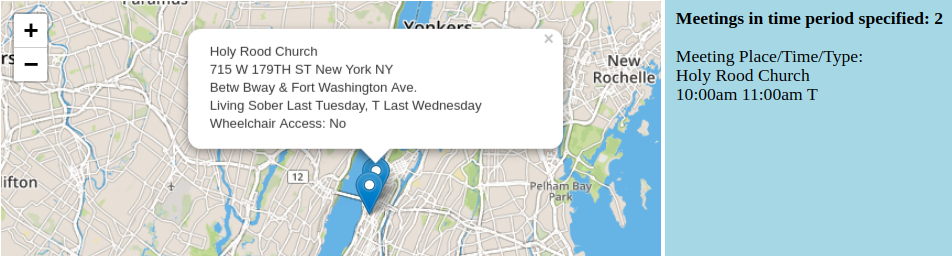
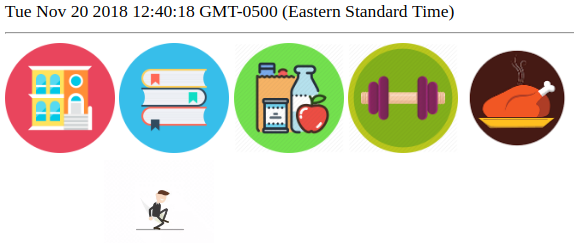
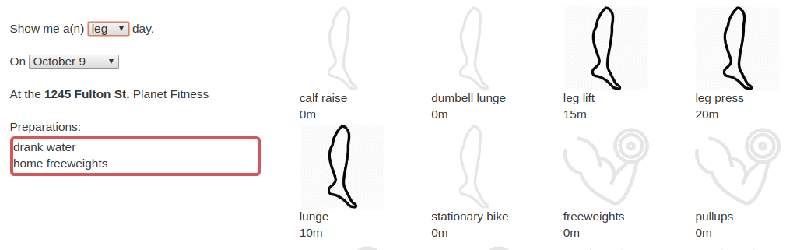

# EC2 Site links for all projects
http://54.146.142.168:8080/ (or click on screenshots below)

# AA Project

[](http://54.146.142.168:8080/aa)

## Goals

My use case was to provide the most near-term (chronologically) help to seekers of AA information as possible.  

## What It Does

To the above end, the map starts in a mode which shows all meetings from current time and for a 6hr window.  I started the project with a 4hr window but as I tested this left a handful of maps with very few markers.  Upping the window to 6hrs seemed a reasonable compromise.  I originally intended to put meeting times in the pop-up bubble but this was too messy for places with several meetings.  I therefore moved all meeting information to the DIV on the right and used the pop-up for title and meta-information (if it existed).

Pop-ups of course respond to clicking, and the meeting information is filled in on a map marker hover event.

## Binding Methods

Since this project was envisioned to be more static, I used a technique very close to the one outlined in class. I have an upper and lower half of HTML that I sew together around the JSON data structure returned from the RDB query.  Additionally I pulled out all the code into a separate js file to constrain the complexity of using the code in the string templates therefore allowing easier debugging.  

At the lowest level, (see server code below) I kept the JSON return structure as small and simple as possible by combining relevant address and meta info strings into one string.  The only string attribute which necessarily remained un-concatenated was title, as I used this in both the DIV and pop-up.


Mapped data from server.js:

```javascript
return {"lat":d.lat, "lon":d.long, "beg":d.tbeg, "end":d.tend, "typ":d.ttype, "title":d.title, "meetings": "<br>" + d.address + "<br>" + d.meta + "<br>" + d.details + "<br>Wheelchair Access: " + wchair};
```


## Issues

Several!  There were the handful of bugs which you might expect.  Working on the client code before I separated it from the template was very error-prone.  While I fixed several incorrect lat/lon lookups before I inserted the data into RDB, mapping revealed (at least) one (Citibank Center) which I did not catch.  These last minute ones I remediated in the server code.

The most unexpectedly worst one, which would have pointed to a more fundamental parsing error with my code, was luckily a problem with the source material.  Zone 4 (4 W 43RD) has a meeting starting at 12:30am and ending at 1:30pm!   

Other than this, the node code was not the most reliable.  I had to build in several error handlers as one in twenty INSERTs would usually fail.  I handled most by successful re-INSERTing but a few stragglers required some manual attention.  In the end, all rows have been successfully entered into the database.


# Sensor Project

[](http://54.146.142.168:8080/se)

## Goals

I have the accelerometer attached to my door.

My initial goal was to visualize the difference between my partner and I when we close the door.  My assertion is that she closes the door much harder than I do.  My intuition suggests that there would be an inversely proportional accelerometer measurement (more powerful) when compared to how tired she is when walking through the door.  This was however, not to be since she got a chance to teach a seminar during the measurement period and was in Europe the entire time.  As a pivot, I realized that since my comings and goings as well as destinations were so limited during this time, I could use the timestamp to create a tongue-in-cheek visualization of My Boring Life.

## What It Does

There is not much difference in accelerometer values between instances when I close the door. There are however valuable time differences.

As mentioned I have been very boring lately. Since I have started sampling, I have been in one of five locations at all times with no variations I can remember. Therefore I will take the duration between door closings to visualize what my life is like.

If the delta between door closings is 91min-10hrs I will assume I was at school

If the delta between door closings is < 45min I will assume I was at Foodtown

If the delta between door closings is > 10hrs I will assume I was in CT for break

If the delta between door closings is 45-90min I will assume I was at Gym


## Binding Methods

Using a map() function I broke all sensor readings into pairs which I assumed are leaving / returning door slams.  The map returns three bits of data which are leave time, destination, and duration at destination for each pair.

This used the same method as above in that I wrote some HTML and included some fake data.  Once I had the main mechanic / css / HTML debugged, I removed the fake data, and split the HTML into a header and footer.  These two pieces of HTML were then transferred by the server with the actual prepared data in between.  


## Issues
Two main issues existed for this one.  First, node .getDay() always goes by UTC as opposed to the browser which goes by EST.  This means that when I was developing the code locally, it would work.  On the EC2 instance however, my 'day' would be incorrect by 5hrs.   Once I realized that the same function worked differently in each context, this was easy to fix.  Secondly, the 'running Michael' takes a bit to load.  This means that in the initial few runs, he runs backwards until the other gif is loaded.  While this is also easy to fix, it delayed the start time a bit too long for me and running blindly/backwards from home to various destinations also felt appropriate and descriptive of my mental state at the time. 

# Diary Project

[](http://54.146.142.168:8080/di.html)

## Goals

Gym was one of the main ways I unwound during the sample period.  Up until this point I had mostly done freeform workouts around a theme.  These were leg, arm, core exercise days respectively.  That said, I would often repeat similar exercises when I wasn't paying attention and focus too much on some subset of muscles.  I wanted to use this visualization to track my progress and easily review my progress.

## What It Does

For the entire set of data, there are two selectors.  These are the three themes mentioned above (leg, arm, core) and a second dropdown populated with the exercise days.  Once the two are selected, the exercises I did that day are highlighted and the duration of each exercise is filled in.

## Binding Methods

In each search, the theme was used as a partition key.  The query then gets all days for that key.  The db is designed to use a partition key in addition to a search key (the exercise date in epoch time).  While I originally wrote the code to a specific query for the partition/search key combo, it infrequently created a delay in displaying the exercise information.  I changed the code to use only the partition key thinking that, even if a delay happens, it will only be once rather than potentially every time I change the date pulldown (triggering another query), and therefore be a better experience.

Additionally, I used xmlHTTP requestors built into jQuery for this one.  The HTML code stands by itself without being templated.  I used $.get() which is a very useful method that retrieves and parses JSON from a url in one go for more dynamic searches.  

## Issues

There weren't many technical issues on this one.  jQuery made dynamic lookups almost easier than the above templating.  That said, motivation was a big issue.  More than once, I went to gym only in service of this diary.
